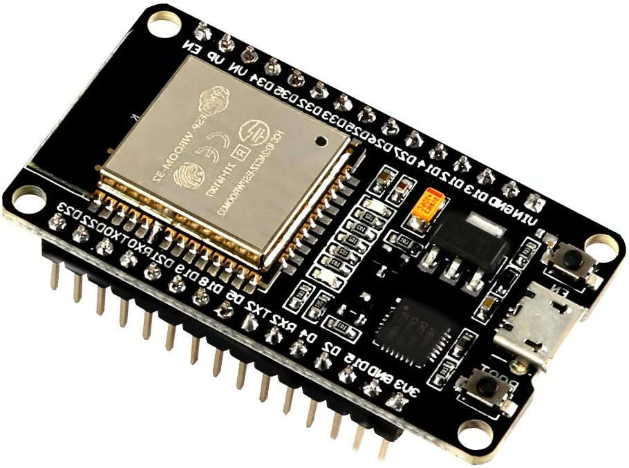

# Simulacion_Sistemas_Electricos

## Tabla de Contenido:
- [Microcontrolador ESP32]()
- [Arduino IDE]()
- [Soporte ESP32]()
- [Libreria PZEM-004T-v30]()

## Microcontrolador ESP32
El módulo ESP32 es una solución de Wi-Fi/Bluetooth todo en uno, integrada y certificada que proporciona no solo la radio inalámbrica, sino también un procesador integrado con interfaces para conectarse con varios periféricos. El procesador en realidad tiene dos núcleos de procesamiento cuyas frecuencias operativas pueden controlarse independientemente entre 80 megahercios (MHz) y 240 MHz. Los periféricos del procesador facilitan la conexión a una variedad de interfaces externas como:

- Interfaz periférica serial (SPI)
- I2C
- Transmisor receptor asíncrono universal (UART)
- I2S
- Ethernet
- Tarjetas SD
- Interfaces táctiles y capacitivas

## Arduino IDE
El entorno de desarrollo integrado (IDE) de Arduino es una aplicación multiplataforma (para Windows, macOS, Linux ) que está escrita en el lenguaje de programación Java. Se utiliza para escribir y cargar programas en placas compatibles con Arduino, pero también, con la ayuda de núcleos de terceros, se puede usar con placas de desarrollo de otros proveedores.

Para el desarrollo del curso se utilizara la aplicacion Arduino IDE, la misma que puede ser descarga en el siguiente [link](https://www.arduino.cc/en/software)

